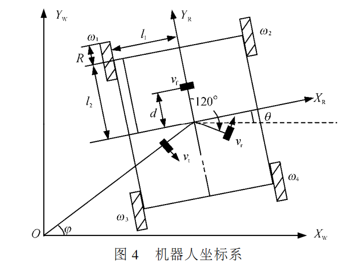

## 三轮全场定位计算公式



#### 标准正三角形的解算公式

|  参数  |  含义  |
|  :-:  | :-:  |
| $X_wOY_w$ | 世界坐标系 |
| $X_RO'Y_R$ | 全场定位自身坐标系 |
| $x,y,\theta$ | 全场定位中心点坐标和偏航角 |
| $v_f,v_i,v_r$ | 三轮速度(逆时针为正方向) |
| $v_x,v_y,\omega$ | 底盘x,y方向运动速度和运动角速度 |
| $d$ | 全场定位中心与全向轮的距离 |

将底盘运动x,y轴速度和角速度在全场定位三轮方向上进行分解：
$$\begin{cases}
v_f = -v_xcos\theta - v_ycos(\frac{\pi}2-\theta) + d\cdot w \\
v_i = v_xcos(\frac{\pi}3-\theta) - v_ysin(\frac{\pi}3-\theta) + d\cdot w \\
v_r = v_xcos(\frac{\pi}3+\theta) + v_ycos(\frac{\pi}6-\theta) + d\cdot w
\end{cases}$$

进行化简：
$$\begin{cases}
v_f = -v_xcos\theta - v_ysin\theta + d\cdot w \\
v_i = v_xsin(\frac{\pi}6+\theta) + v_ysin(\theta-\frac{\pi}3) + d\cdot w \\
v_r = v_xsin(\frac{\pi}6-\theta) + v_ysin(\theta+\frac{\pi}3) + d\cdot w \\
\end{cases}$$

根据上述三式反解出$v_x,v_y,\omega$:
$$\begin{cases}
v_x = -\frac23cos\theta\cdot v_f +\frac{cos\theta+\sqrt3sin\theta}3\cdot v_i +\frac{cos\theta-\sqrt3sin\theta}3\cdot v_r \\
v_y = -\frac23sin\theta\cdot v_f +\frac{sin\theta-\sqrt3cos\theta}3\cdot v_i +\frac{sin\theta+\sqrt3cos\theta}3\cdot v_r \\
w = \frac1{3d}\cdot v_f + \frac1{3d}\cdot v_i + \frac1{3d}\cdot v_r
\end{cases}$$

假设采样周期为$\Delta t$，更新底盘坐标和角度：
$$\begin{cases}
x' = x + v_x\cdot\Delta t \\
y' = y + v_y\cdot\Delta t \\
\theta' = \theta + w\cdot\Delta t \\
\end{cases}$$

#### C语言代码
```c
//底盘坐标(mm)
float position_x = 0;
float position_y = 0;
float position_yaw = 0; //角度（-180~180）

float position_d = 100; //码盘轮子到全场定位中心的距离（毫米）
float delta_t = 5; //5ms计算一次

//坐标解算
void calculate_position(float v_f, float v_i, float v_r)
{
    float v_x; //底盘x方向速度(mm/ms)
    float v_y; //底盘y方向速度(mm/ms)
    float w; //底盘旋转角速度(°/ms)

    float theta = position_yaw*PI/180; //偏航角转化为弧度

    //由三轮速度解出v_x,v_y,w
    v_x = -2*cos(theta)/3*v_f + (cos(theta)+sqrt(3)*sin(theta))/3*v_i + (cos(theta)-sqrt(3)*sin(theta))/3*v_r;
    v_y = -2*sin(theta)/3*v_f + (sin(theta)-sqrt(3)*cos(theta))/3*v_i + (sin(theta)+sqrt(3)*cos(theta))/3*v_r;
    w = v_f/(3*position_d) + v_i/(3*position_d) + v_r/(3*position_d);

    //更新坐标
    position_x += v_x*delta_t;
    position_y += v_y*delta_t;
    position_yaw += w*delta_t;
}

```

