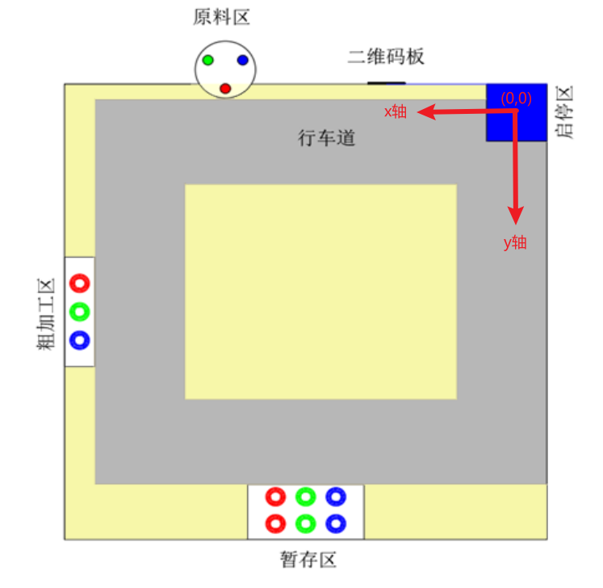

# 通信协议 v1.0

## 串口配置

通信方式是串口，配置为波特率 115200，8 位数据位，1 位停止位，无硬件流控，无校验位。

## 通信协议格式

|帧头|数据|帧尾|
|:-:|:-:|:-:|
|frame_header(5-Byte)|data(n-Byte)|frame_tail(2-Byte,CRC-16,仅校验data)|

## frame_header格式

|SOF|cmd_id|length|CRC-8|
|:-:|:-:|:-:|:-:|
|0xA5(1-Byte)|命令码(1-Byte)|data长度(2-Byte)|帧头校验(1-Byte)|

## 命令码说明

|cmd_id|数据类型|
|:-:|:-:|
|0x01|trolley_info_t|
|0x02|move_cmd_t|
|0x03|pinch_cmd_t|

## 数据类型详情

    typedef struct
    {
        int32_t x_abs;
        int32_t y_abs;
        int32_t angle_abs; // 角度制
        int32_t block_num; // 车载物块数量，上限为3
    } trolley_info_t;

上述坐标以下图坐标系为参考，角度信息以x轴正方向为0度，取值范围（-180,180]。
（下图仅作示意，具体位置待实际测量）

    typedef struct
    {
        int32_t vx_err;
        int32_t vy_err;
        int32_t vw_err;
    } move_cmd_t;

上述信息均为相对值，相对于车的当前位置及朝向。或者说，是可以直接用于PID算法的error值。

    typedef struct
    {
        uint8_t act_id; // act_id对应动作编号（1-抓取，2-放置）
    } pinch_cmd_t;

